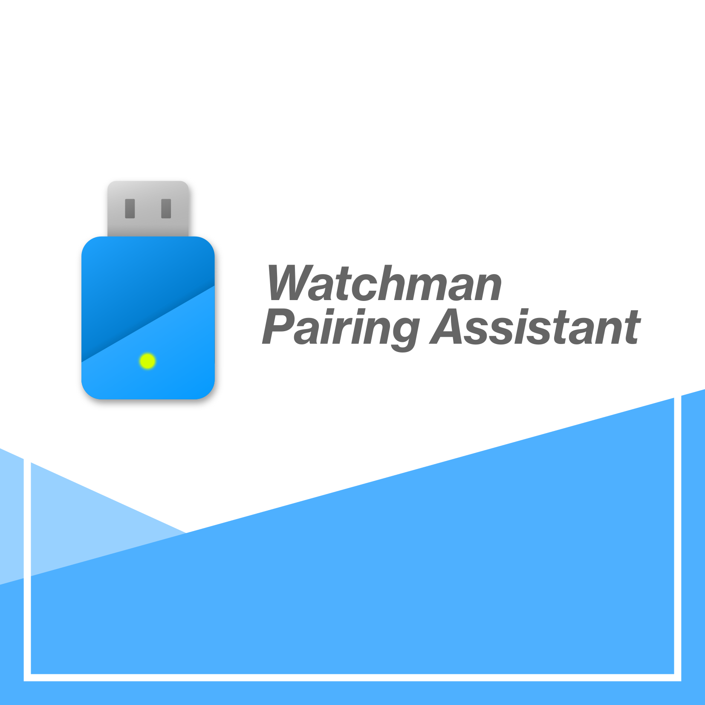
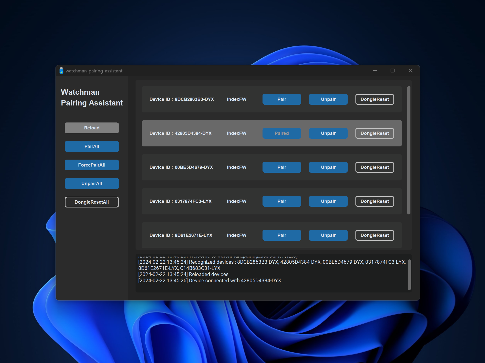

# WatchmanPairingAssistant
GUI for pairing SteamVR Tracking devices using lighthouse_console

# Using it

## Manual (any platform)

1. clone the repo using `git clone https://github.com/TayouVR/WatchmanPairingAssistant.git`
2. To install dependencies run `pip3 install -r requirements.txt`
3. run `python3 main.py`

## Linux

### NixOS
```nix
nix run github:TayouVR/watchman-pairing-assistant
```

### Other
Download the latest version from [Releases](https://github.com/EinDev/watchman-pairing-assistant/releases) and follow the instructions.

## Windows
Download the latest version from [Releases](https://github.com/EinDev/watchman-pairing-assistant/releases) and execute it.



